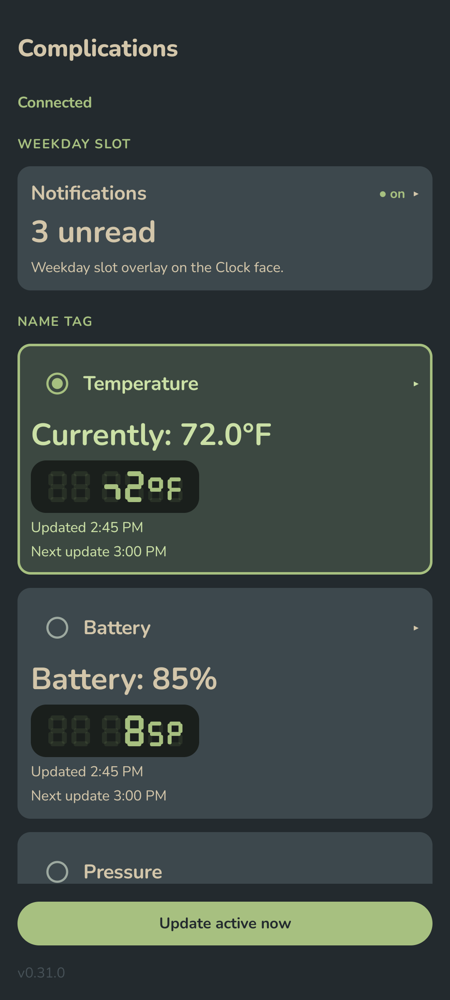
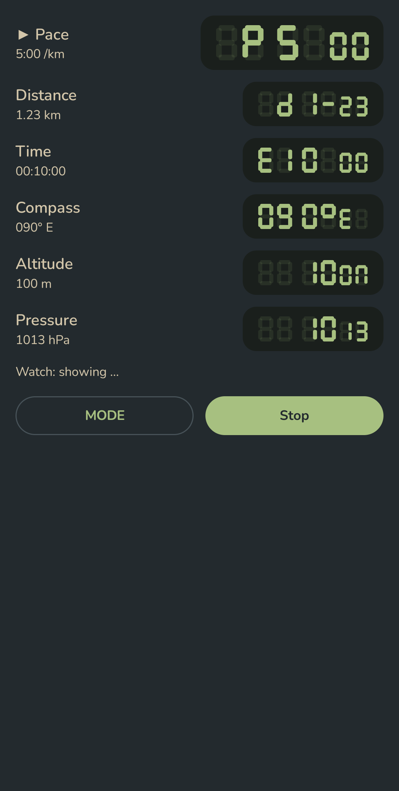
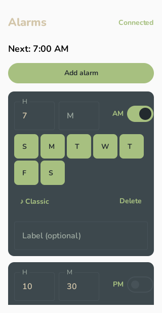

# Super FreeOllee

A self-contained Android companion app for the Ollee watch, talking to it directly
over Bluetooth Low Energy.

## Screenshots

| Complications | Activity | Alarms |
|:---:|:---:|:---:|
|  |  |  |

<sub>Generated per-screen by the accessibility + screenshot CI job.</sub>

## Features

**Complications** — pushes one of several values to the watch's 6-character "Name tag"
(held under ALARM on the Clock face), refreshed automatically in the background:

- The current temperature in °F (via Open-Meteo).
- Today's step count, read from Android Health Connect (whatever app you use writes it
  there — a fitness ring, phone pedometer, etc.).
- A custom 6-character string (for experimentation).

**Notification badge** — counts the phone's undismissed notifications and shows the count
in the watch's weekday slot (requires granting Notification access; renders on the Clock
face only).

**Timers** — build and push sets of interval timers to the watch's Timer face, plus a
one-tap quick timer and remote start (the watch starts counting the moment the frame
lands). The quick timer also has an **alarm mode** — flip it on to enter a wall-clock time
(H:M AM/PM) instead of a duration, and the app sends the watch a one-shot countdown that
fires at that time (rolling to the next day for times already past, up to ~24h out). Slots
within a set can be sorted by duration or hand-reordered with ▲/▼, and the
set library on the dashboard can be reordered the same way.

**Alarms** — up to 5 alarms with day-of-week repeats, labels, and all 15 watch chime
tones by name. The watch itself stores only a single alarm with no day field, so the app
computes the soonest occurrence and re-arms the watch's one slot after every edit and
every fire — without disturbing the watch's hourly-chime settings, which live in the same
BLE record. If a re-arm push can't reach the watch it retries at 2/5/15 minutes, then posts a
notification with a Retry action — a missed push otherwise means a silently skipped alarm.

**Activity mode** — a GPS-tracked walk/run that streams live **pace**, **distance**, and
**time** to the watch's name tag while you move. Start and stop from the phone's Activity
tab; tap **MODE** to cycle which metric the watch shows (the change lands immediately).
The session runs in a foreground service with an ongoing notification, so tracking survives
the screen turning off, and it disables the watch's auto-sleep for the duration so pushes
keep landing — then restores your previous auto-sleep setting on stop (and on crash
recovery, if the app is killed mid-session). Distance and pace render in miles/min-mi or
km/min-km via the units toggle. Every session is saved as a Strava-ready track file (SI
units, with per-point altitude) under the app's `files/activities/`, and the last activity's
distance/time/average-pace summary shows on the Activity tab. Works with no watch selected
too — it still records the track.

**Connection status** — every screen shows the current watch link in its top bar (`Connected`,
`Connecting…`, or a tappable `⟳ Reconnect`), so you always know whether a push will actually reach
the watch.

Originally built as a workaround for GrapheneOS users — the official Ollee app relies on Google Play
Services' Fused Location Provider, which is absent on GrapheneOS. This app uses the
platform `LocationManager` directly (so location works without Play Services) and also
accepts manual lat/lng entry.

The BLE packet format, CRC-16/CCITT-FALSE implementation, and Nordic UART service/
characteristic UUIDs were reverse-engineered by Arthur86000's
[FreeOllee](https://github.com/Arthur86000/FreeOllee). This app re-implements the
protocol in-tree rather than depending on the FreeOllee APK.

## Reference

- BLE protocol notes: [`docs/reference/ollee-ble-protocol.md`](docs/reference/ollee-ble-protocol.md)

## Building

Super FreeOllee is now a **Kotlin Multiplatform** app with a single Android target,
built with Compose Multiplatform. The debug build command is unchanged:

```
./gradlew :app:assembleDebug
```

The debug APK lands in `app/build/outputs/apk/debug/`.

### Cross-platform status

The app logic and the Compose UI live in `commonMain`; the Android-specific I/O
(BLE, Health Connect, location, prefs, the background engine) sits behind plain
interfaces with Android implementations injected at startup. iOS is a future step — there are **no iOS targets in the build
yet**, so this currently builds and ships as an Android app only.

## Releases

Every merge to `main` triggers `.github/workflows/release.yml`, which builds a
release-signed APK, tags the commit `v<VERSION>` (from the [`VERSION`](VERSION) file),
and publishes it as a GitHub Release — see the
[Releases page](https://github.com/kenblizzardcaron/FreeOllee-Faces/releases). A PR can
opt out by putting `[skip release]` in its title; a companion workflow rejects merges
that forget to bump `VERSION`. APKs are not committed to the repository.

The easiest way to stay current without hand-downloading each APK is
[Obtainium](https://obtainium.page) — point it at this repo's Releases and it will track,
notify, and install new versions for you straight from GitHub.

## License

Super FreeOllee is free software, licensed under the **GNU General Public License v3.0**
(see [`LICENSE`](LICENSE)). You may redistribute and/or modify it under those terms; any
distributed derivative must remain GPL-licensed with source available.

    Copyright (C) 2026 Ken Blizzard-Caron <ken@blizzardcaron.com>

    This program is free software: you can redistribute it and/or modify it under the
    terms of the GNU General Public License as published by the Free Software Foundation,
    either version 3 of the License, or (at your option) any later version.

    This program is distributed in the hope that it will be useful, but WITHOUT ANY
    WARRANTY; without even the implied warranty of MERCHANTABILITY or FITNESS FOR A
    PARTICULAR PURPOSE. See the GNU General Public License for more details.

    You should have received a copy of the GNU General Public License along with this
    program. If not, see <https://www.gnu.org/licenses/>.

The BLE protocol (packet framing, CRC-16/CCITT-FALSE, Nordic UART UUIDs) was originally
reverse-engineered by Arthur86000's [FreeOllee](https://github.com/Arthur86000/FreeOllee);
this app is an independent in-tree re-implementation. Those are interoperability facts, not
copied code — the attribution is a courtesy, not a license obligation (FreeOllee declares no
license of its own).
